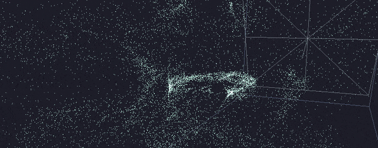
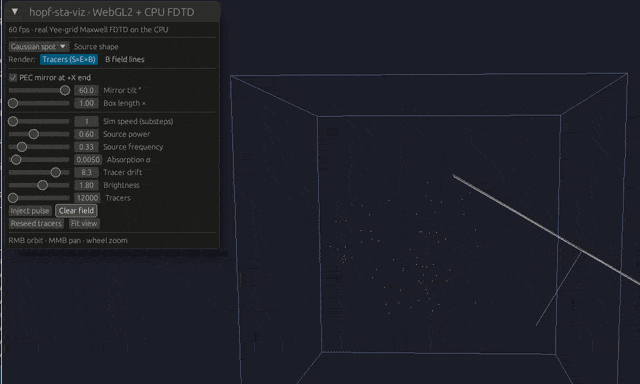

# hopf-sta-viz

## What are we going to see?

**Advanced STA4D to 3Dem-world.**

This is a realtime, GPU-accelerated 3D visualizer that projects 4-dimensional Minkowski spacetime physics directly into our 3D world. Using Spacetime Algebra (STA), it models a **Rañada–Hopf electromagnetic knot** (a _hopfion_). Instead of standard plane waves, you are looking at topologically locked light where the electric, magnetic, and energy flow lines form perfectly linked, closed loops.

## Online Demo

\*\*→ [Live WebGPU Demo: hopf-sta-viz\*\*](https://springyworks.github.io/hopf-sta-viz/)

_(Requires a WebGPU-capable browser: Chrome/Edge 113+ or Safari 18+. Firefox users must enable_ `_dom.webgpu.enabled_` _in_ `_about:config_`_.)_

  


---

## How it works

The entire simulation runs directly on the GPU. It is written in **Rust** using `wgpu` (Vulkan/DX12/Metal), with all field evaluations, time-stepping, and particle tracking executing natively inside **WGSL compute shaders**. The CPU only handles the camera and UI dispatches.

*   **Live Maxwell Solver:** A Yee leapfrog finite-difference time-domain (FDTD) integrator runs on an anisotropic 384×128×128 grid. It calculates the $\\mathbf{E}$ and $\\mathbf{B}$ field evolution every frame.
*   **Knotted-Light Seeding:** The grid initializes with a hopfion donut configuration, which then propagates strictly according to discrete Maxwell equations.
*   **Particle Advection:** Thousands of tracer particles flow along the Poynting flux ($\\mathbf{S} = \\mathbf{E}\\times\\mathbf{B}$), mapping the physical energy transport.
*   **Interactive Sandbox:** Includes a movable perfect-electric-conductor (PEC) mirror to bounce and interfere the pulse, an auto-pulse engine, and simulation speed controls.

## Build & Run

Requires a modern Rust toolchain and a Vulkan/DX12/Metal-capable GPU.

**Native Desktop:**

```
cargo run --release
```

_Note: Always build with_ `_--release_`_. The compute pass executes millions of grid updates per frame and relies heavily on compiler optimization._

**WebAssembly (WebGPU):**  
The exact same Rust solver compiles for the web without modification using [trunk](https://trunkrs.dev).

```
trunk build --release
```

_(Outputs to_ `_dist/_`_, which can then be served locally or pushed to GitHub Pages)._

## The Mathematics

In Spacetime Algebra (STA), the complete electromagnetic field is represented as a single unified Faraday bivector:

$$F = \\mathbf{E} + I,\\mathbf{B}$$

In a source-free vacuum, Maxwell's equations collapse elegantly to a single geometric equation:

$$\\nabla F = 0$$

This engine simulates a _null_ field solution ($F^2 = 0$). By applying the Bateman construction to complex scalars, space is foliated into the linked circles of a Hopf fibration, ensuring the field lines are pairwise linked with a topological linking number of exactly 1.

---

## License

[MIT](https://www.google.com/search?q=LICENSE) © springyworks